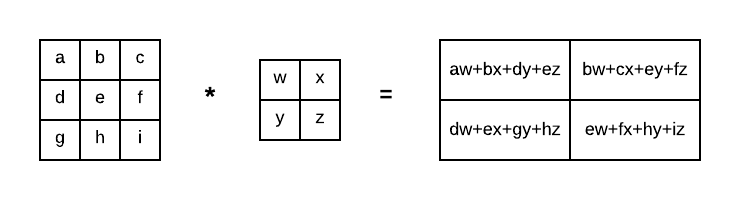

Title: Foundations Convolutional Neural Network
Date: 2020-07-15 06:42
Category: Deep Learning
Slug: cnn
Summary: Nuts and bolts of CNN
Tags: pelican, markdown
Authors: Bishwa Karki
Status: published

CNN is a type of neural network that uses at least one convolution layer. The convolution layer uses convolution operation.

Given a image and kernel, the convolution is just a weighted average of neighbouring pixels.

# Inputs, filter and outputs:

Consider a image of width(W1), height(H1), and depth(D1) in which we will convolve K filter of size F with stride S then output is given by :

W2 = ((W1 - F)/s) + 1  
H2 = ((H1 - F)/s) + 1  
D2 = K

so if we have image of shape (28,28,3) and if we use 16 kernel of shape (5,5,3) with stride of 2, then output is:

W2 = ((28-5)/2) + 1 = 12.5 == 12  
H2 = ((28-5)/2) + 1 = 12.5 == 12  
D2 = 16  

so the output is (12,12,16)

Here we round down the number 12.5 to 12.

# Padding:

Doing convolution and stride restrict the network learn features from the corner beacause the are visited single time during convolution. So the pixels in the center will have more influence. To overcome this we want our network to learn patterns from the corners as well and we will do this using padding.

Calculation after using padding:

W2 = ((W1 + 2P - F)/s) + 1  
H2 = ((H1 + 2P - F)/s) + 1  
D2 = K  

