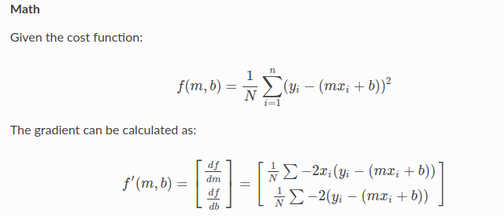
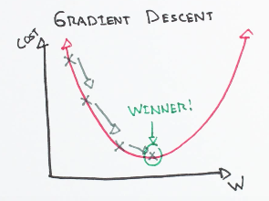
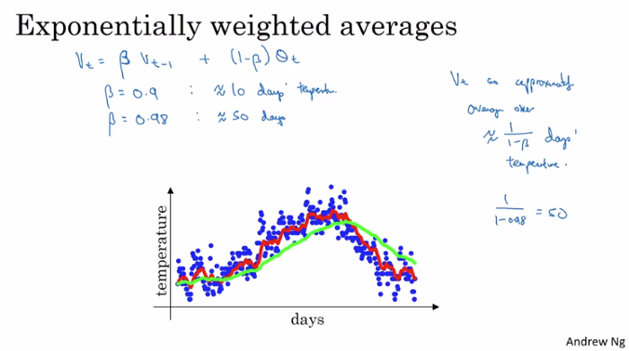

Title: Optimization Algorithms
Date: 2020-06-30 06:42
Modified: 2020-06-30 06:42
Category: Deep Learning
Slug: optimization-algorithm
Summary: In this article, I have written summary of optimization algorithms used in Deep Learning
Tags: pelican, markdown
Authors: Bishwa Karki
Status: published

In this article I wanted to talk about the series of optimization algorithm in a sequential way from simple gradient descent to ADAM optimizer.

## Gradient Descent

Gradient Descent is an optimization algorithm used to optimize some cost function in a iterative way.
I think math says alot more then text :), so let's directly jump into it's simple mathematics:

Given the cost function we calculate partial derivative of the cost function with respect to the parameters. After calculating the partial derivative of the cost function we make and update to the parameters so that each time the cost function moves towards minimum.

This is the root theme of gradient descent, calculate the partial derivative of the cost function with respect to the parameters and update the parameters with the partial derivatives to get the minimum cost function for all the data.

# Variations of Gradient Descent

1. ** Batch Gradient Descent: **

In batch gradient descent all the data are taken into consideration. So if we have 10000 data and if we run for 5 epochs then the gradient descent loop will run for 5 times and for each time, the partial derivative is calculated and update is performed for all 10000 data.

But wait, what if the data points are large i.e in millions ?

So in that case, this may not work properly because the entire data must have to fit in CPU or GPU and this runs memory error and update is delayed since it has to calculate partial derivative of all the points before making update.

2. ** Stochastic Gradient Descent: **

So from the batch gradient descent we knew that it may not work well on large data. So now we divide the data into chunk of batches which will now fit into CPU/GPU.

In this, we will take 1 data at a single time, so this makes an faster update because we will calculate the cost for each data point and perform update.
But wait: suppose for 5 million of data and running for 5 epochs, in 1 epoch we need to run/iterate 5 millions of times and for 5 epochs 5*5 millions, so this might be slow if we have large data and we run for more number of epochs. 

Also, since we are considering 1 example at a time the cost will fluctuate over all the data and it may not reach the minimum.

3. ** Mini-batch Gradient Descent: **

Batch G.D converges to minimum but for large data it will be harder to learn and Stochastic G.D converges for large data but we are taking one data at a time so this slow downs the computations.
To overcome these problems we have a Mini-batch G.D .

In Mini-batch neither we will use all the data nor we will use 1 data at each time but we will use batch of fixed number of training data. For example if we have 500 data then lets divide it into chunk of 100, so we will get 5 chunk each of size 100. Now in 1 loop of gradient descent we will calculate the partial derivative for 100 data and make an update and so on for next batch.

So in this case for 1 epoch we will iterate 5 times.

## Exponentially Weighted Averages:

With gradient descent, we have an hyperparameter known as learning rate. When the learning rate is high then the time for optimization is decreased but there is more oscillations in the parameters during the update. While the learning rate is low then the optimization takes more time to compute. So in order to make computation faster we need to keep learning rate high but with it we must handle oscillation problem of the parameters. So to handle this we have exponentially weighted averages.

Vt = β * (Vt-1) + (1-β)*NewSample

Here the beta parameter controls how much weight to give to the N values.

Simple average has higher accuracy then weighted average but the computation cost of simple average is more. So exponentially weighted average is highly suited for machine learning optimizations.

** Gradient Descent with momentum: **

We have seen how exponentially weighted average works, now we apply it to update the parameters which lets us use larger learning rate.

On each mini-batch, we compute derivate(dw, db) of the parameters.

V_dw = β * V_dw + (1-β) * dw
V_db = β * V_db + (1-β) * db

Update:

w := w - learning_rate * V_dw
b := b - learning_rate * V_db

## RMS Prop:

We have gradient descent optimization, we solved it's problems and now we can use high learning rate. But there are many parameters to be learned in machine learning problems and we want the parameters with high partials derivative to be update faster while parameters with small slope to update slower. Saying that, it means we want to control update to parameters individually.

S_dw = β * S_dw + (1-β) * dw**2
S_db = β * S_db + (1-β) * db**2

Update:

w := w - learning_rate * dw / Sqrt(S_dw)
b := b - learning_rate * dw / Sqrt(S_db)

## ADAM:

When S_dw = 0 then RMS prop will blow up. So ADAM uses both momentum and RSM prop.

V_dw = β_1 * V_dw + (1-β_1) * dw
S_dw = β_2 * S_dw + (1-β_2) * dw**2

Update:

w := w - learning_rate * (V_dw  / Sqrt(S_dw))